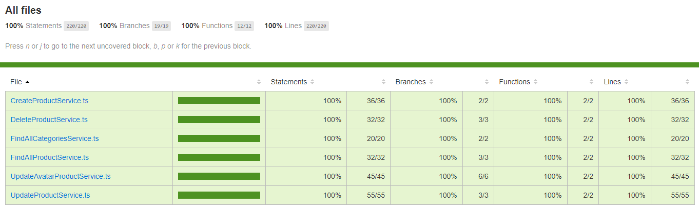

# Produtos.

Para rodar o projeto tem que ter o [Docker](https://www.docker.com/) instalado na sua maquina.

> Para subir os contêineres.

```bash
docker-compose up -d
```

> Para deletar os contêineres.

```bash
docker-compose down
```

```bash
yarn typeorm migration:run
```

[Documentação](./docs/doc.md)

**Requisito Funcionais.**

- [x] = Criar um produto com sua categoria.

- [x] = Criar uma migration para adicionar uma coluna, avatar.

- [x] = Adicionar Foto do produto.

- [x] = Listar todos os produtos a partir do id da categoria.

- [x] = Listar todas as categorias.

- [x] = Atualizar o nome da categoria e os produtos.

- [x] = validar dados na rotas.

- [x] = Para deletar o produto sera necessário o id do produto.

- [x] = Para atualizar o produto sera necessário o id do produto.

- [x] = Para listar os produtos da categoria, sera necessário id da categoria.

- [x] = Controlar os limites de requisições feitas pelo mesmo ip/usuário.

- [x] = Adicionar cache nas listagens dos produtos.

- [x] = Adicionar paginação na listagem das categorias e produtos.

**Requisito não Funcionais.**

- [x] = Para Criar, deletar, etc. Usar o `TypeORM`.

- [x] = Banco de dados `PostgreSQL`.

- [x] = Para salvar a foto no disco, usar o `multer`.

- [x] = Para testes usar o `jest`.

- [x] = Build do projeto com o `babel`.

- [x] = Injeção de dependência com `tsyringe`.

- [x] = Para validar os dados usar o `celebrate`.

- [x] = Usar `class-transformer` para controlar as respostas.

- [x] = Para controle de requisições usar `rate-limiter-flexible` e `redis`.

- [x] = Para armazenar o cache usar o `redis` e para operações `ioredis`.

**Regra de Negócios.**

- [x] = Somente criar se a categoria não existir no banco.

- [x] = Ao criar produto deve criar junto a categoria do produto.

- [x] = Para criar um avatar do produto deve checar se o produto existe.

- [x] = Para atualizar produto deve checar se o produto existe.

- [x] = Para deletar produto deve checar se o produto existe.

- [x] = Para listar os produtos o id da categoria deve ser igual ao category_id da tabela products.

- [x] = As categorias e produtos listadas devem conter um limite passando pela query para paginação.

---

# Coverage.


